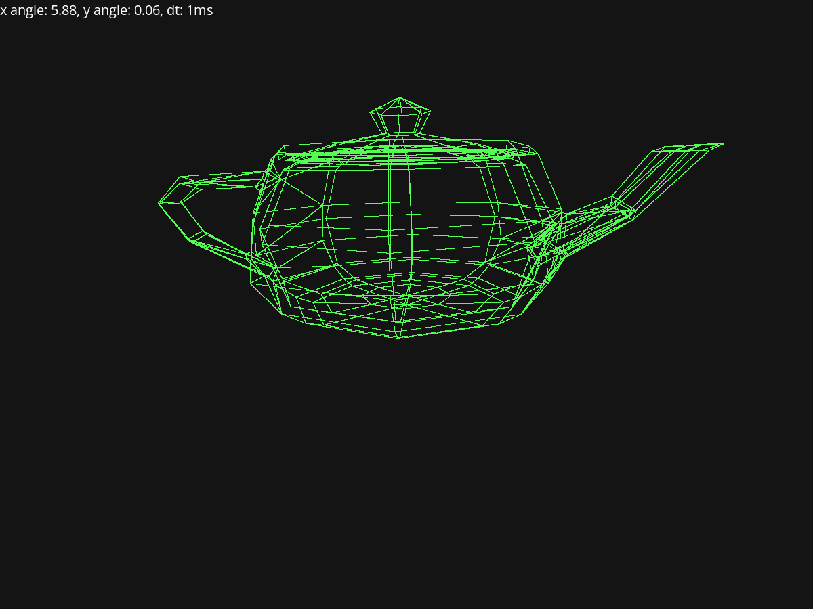

# renderer

a simple point renderer


## Running

to run the code run the following commands

```bash
git clone https://github.com/ogwen123/point-renderer.git
cd point-renderer
git clone https://github.com/libsdl-org/SDL.git vendored/SDL
git clone https://github.com/libsdl-org/SDL_ttf.git vendored/SDL_ttf
# follow installation instructions for SDL_ttf at https://github.com/libsdl-org/SDL_ttf/blob/main/docs/INTRO-cmake.md
mkdir build
cd build
cmake ..
cmake --build .
```

## TODO

-   [x] load and display wavefont OBJ files
    -   [ ] add function to center models so they rotate correctly
-   [ ] fix the larger teapot model immediately crashing the program
